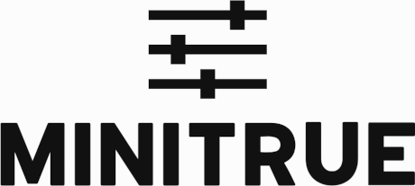

<p align="center">
  
</p>

> Configuration as code is the formal migration of config between environments, backed by a version control system.

## What is minitrue?

minitrue is a command line application that helps you manage your configuration. It stores your configuration variables
in your Git repository and encrypts them using GPG.
minitrue is [OpenSource](LICENSE).

## Getting started

```
minitrue init
```

```
minitrue add_key
```

```
minitrue set
```

```
minitrue env
```

```
minitrue unset
```

